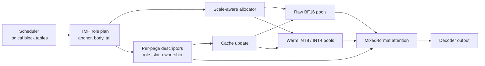
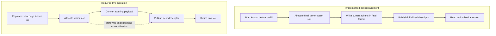

# 3. TMH Design

## 3.1 Design goals

TMH was built around four requirements.

**Preserve logical identity.** Prefix caching and request block tables should continue to name the same logical page after its physical representation changes.

**Keep the write frontier simple.** Newly decoded tokens belong in native storage. Quantization should not be mandatory for the page receiving the next token.

**Compress stable state without eviction.** The old body remains addressable. TMH changes how its bytes are stored, not which token positions exist.

**Expose the cost of heterogeneity.** Pool sizes, scale tensors, descriptors, and kernel branches are part of the design. None is hidden behind an abstract compression ratio.

The implementation uses fixed-size pages because they match the server's existing allocation unit. Page granularity also keeps the physical descriptor small: one role and one slot describe every token in an attention tile.

## 3.2 Four page roles

A request is divided into an anchor, a stable body, and a recent tail. Layer depth further divides the body into two value formats.

| Role | Sequence region | Key storage | Value storage | Intended behavior |
|---|---|---|---|---|
| `PINNED_RAW` | first page | BF16 | BF16 | long-lived anchor; never demoted by the current policy |
| `HOT_RAW` | recent tail | BF16 | BF16 | mutable write frontier and immediately reused context |
| `WARM_INT8_INT4` | old body, early layers | INT8 | packed INT4 | highest-capacity retained representation |
| `WARM_INT8_INT8` | old body, late layers | INT8 | INT8 | more conservative representation near the output |

For a network with $L$ layers, the late region starts at

$$
L_{late}=\left\lfloor\frac{2L}{3}\right\rfloor.
$$

Layers below $L_{late}$ use INT4 values in the warm body; the remaining layers use INT8 values. A 48-layer model consequently has 32 early and 16 late layers. Page age decides whether a page is raw or warm, while the layer decides which warm value format applies.

The first page receives a separate role for two reasons. Early tokens can act as attention sinks [@xiao2023streamingllm], and the first block is often a durable prefix-cache object. Pinning it is a coarse safeguard, not a claim that every first-page token is semantically important.

## 3.3 From policy to physical storage

The scheduler already owns the sequence length, logical block table, and request lifetime. TMH derives page ranges from that state and records them in a compact plan. Each range names a layer interval, page interval, role, precision, pinning state, and ownership domain. No attention scores are consulted. For a fixed geometry and hot budget, the mapping is deterministic.

Calling this step a compiler is useful only in a limited sense. It lowers semantic ranges into descriptors and pool requirements; it does not perform search or code generation. We therefore call the algorithm *plan construction*.

Figure 1 shows the path from the serving scheduler to the two physical representations.

**Figure 1. TMH dataflow.** The scheduler continues to name logical blocks. TMH resolves each block to a representation-specific slot before cache update and attention.

The plan deliberately contains more meaning than the GPU consumes. Pressure priority and recomputation policy belong in the control plane. The kernel needs only a role and physical slot for each page. Separating those views prevents scheduler policy from becoming hot-loop metadata.

## 3.4 Logical blocks and physical slots

A homogeneous paged cache can use the block number as a direct index into one tensor. TMH cannot: raw and warm pages have different shapes, and early warm values are packed. The physical mapping is therefore

$$
(b,l) \longrightarrow (r,s),
$$

where $b$ is a logical block, $l$ is a layer, $r$ is the role, and $s$ is a slot in the pool associated with that role and layer.

Canonical tables store the representation attached to the shared logical block. Request tables resolve the pages visible to one active sequence. In the common private case, the request table points directly to canonical storage. Prefix sharing allows several request views to resolve to the same canonical slot.

The logical block remains the authority for hashing and sharing. A physical slot is an implementation resource with a shorter lifetime. Losing that distinction would make representation changes visible to the scheduler and would complicate every consumer of the block table.

## 3.5 Direct placement

Long prompts reveal many old pages during prefill. Their final role is already known once the prompt length and hot budget are fixed. TMH can allocate those pages in the warm pool before their KV vectors are produced. Cache update quantizes each token directly into its destination; there is no raw intermediate and no later copy.

Direct placement is the cleanest part of the design and the only heterogeneous write path used by the present evaluation. It saves both temporary space and migration traffic. Its cost is paid during prefill, where extrema, scales, integer conversion, and packing accompany the cache write.

Decode normally appends to `HOT_RAW`. The frontier page stays raw until it leaves the tail. If the server never moves a populated page, the raw reserve must be large enough to retain every page that began hot. Direct prefill avoids that outcome for prompt pages, but it does not by itself create an adaptive hierarchy during long generation.

## 3.6 Dynamic transitions

A working raw-to-warm transition needs five ordered steps:

1. allocate a destination in the correct warm pool;
2. convert every valid token from the raw page;
3. wait until the destination is complete;
4. publish the new role and slot to readers; and
5. release the old raw slot after its final reader has retired.

Publication cannot precede conversion. Doing so makes the descriptor claim that a page exists in a slot whose payload is empty or partial. Figure 2 separates the working direct-placement path from the incomplete live path.

**Figure 2. Page materialization paths.** Direct placement writes valid data before publication. The evaluated runtime has metadata for live transitions but lacks the conversion step shown in the lower path.

The incomplete path is not used as evidence for correctness or quality. It remains in the design because migration is what would turn a static mixed cache into a pressure-responsive hierarchy.

## 3.7 Prefix sharing and request-local views

Prefix reuse introduces a second representation conflict. Suppose a canonical prefix page has become warm. A new request reuses that prefix and begins decoding close enough to the boundary that the page falls inside its raw tail. Globally promoting the page would spend raw memory on behalf of one request and change the representation seen by every other reader.

TMH assigns a request-local overlay instead. The canonical block stays warm; the new request receives a private raw slot and a descriptor that overrides canonical resolution for that page. Releasing the request frees the overlay without disturbing the shared page.

The ownership rule is sound, but the implementation is incomplete in the same way as live demotion. A raw overlay must be populated by dequantizing the canonical warm page before attention reads it. The prototype allocates the slot and records its ownership but leaves its contents empty. Prefix overlays are consequently a design mechanism, not a supported data path in the evaluation.

An alternative would keep the boundary page warm for the new request. That choice weakens the raw-tail policy but preserves data. Until overlays can be materialized, retaining an already valid representation is safer than publishing an empty one.

## 3.8 Capacity model

Let $B$ be tokens per page, $N$ the number of KV heads, $D$ the head dimension, and $s_r$ the raw scalar width. One raw page at one layer costs

$$
R=BN(2D)s_r.
$$

Warm pages store one byte per key element, one byte or one nibble per value element, and two FP32 scale words per token and head:

$$
W_e=BN\left(D+\left\lceil\frac D2\right\rceil+8\right),
$$

$$
W_l=BN(2D+8).
$$

For the evaluated geometry—$B=16$, $N=4$, $D=128$, BF16 raw storage—one raw page per layer uses 32,768 bytes. Early and late warm pages use 12,800 and 16,896 bytes respectively. Averaged over 32 early and 16 late layers, a warm page costs 14,165.33 bytes per layer.

At a raw fraction $\rho=0.25$ and an eight-byte descriptor term,

$$
C(0.25)=0.25(32768)+0.75(14165.33)+8=18824\ \text{bytes}.
$$

The continuous capacity multiplier is therefore $32768/18824\approx1.741$. The physical allocator performs the same calculation with integral pool sizes, an anchor reserve, and a finite device budget. Its recorded result is 73.82% more logical KV blocks than the all-raw layout for the evaluated profile.

That number is conditional on the planned raw/warm mix. A workload dominated by short requests or raw overlays can exhaust the raw class while warm slots remain free. Separate pools exchange average capacity for class fragmentation. Dynamic rebalancing would need the migration path that the prototype lacks.

## 3.9 What the design presently supports

The implemented contract is narrower than the four-role diagram might suggest:

- prompt pages may be assigned directly to raw or warm storage before they are written;
- decode appends to raw storage;
- attention may read an initialized mixture of raw and warm pages;
- logical block identity and canonical sharing remain intact for those initialized pages; and
- pool allocation and descriptor cleanup operate by representation class.

Live demotion, populated overlays, and pressure-driven rebalancing are outside the supported envelope. Keeping the boundary explicit lets the rest of the paper evaluate what exists without discarding the broader architectural question.
