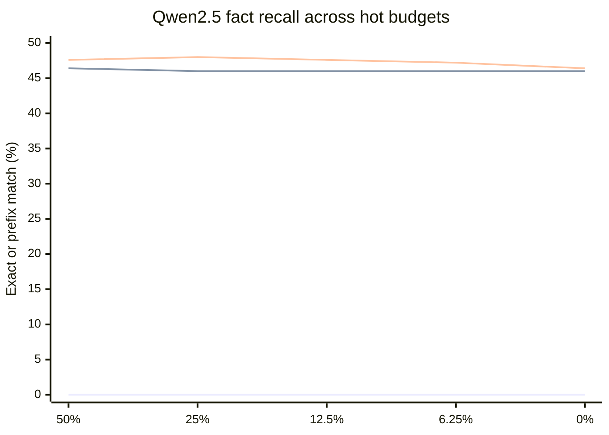
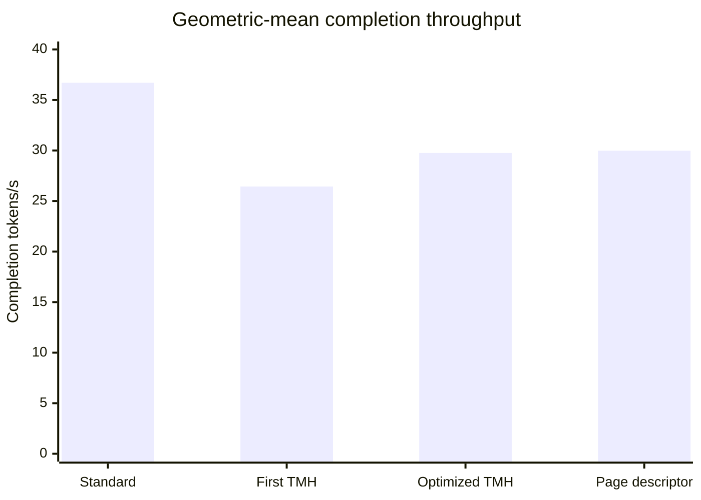

# 6. Results and Ablations

## 6.1 Capacity

Table 4 summarizes the two capacity comparisons. They use different denominators. The first asks how many logical blocks fit relative to an all-BF16 cache. The second holds the raw anchor and tail fixed, then compares only the old body against uniformly INT8 keys and values.

**Table 4. Capacity results and their denominators.**

| Comparison | Geometry | Result |
|---|---|---:|
| physical pool vs all-BF16 | 48 layers, 25% raw reserve, scales and descriptors included | 1.741x idealized; 73.82% discrete increase |
| old body vs same-hot INT8 K/V | 48 layers | 16.667% fewer payload bytes |
| old body vs same-hot INT8 K/V | fifteen model configurations | at least 16.071% fewer payload bytes |

The model-family floor comes from 28-layer models. With $\lfloor2L/3\rfloor=18$ early layers, the early region occupies less than two thirds of the network, reducing the share of INT4 values. A one-layer all-late synthetic model receives no INT4 benefit at all. The familiar one-sixth reduction is exact for the 48-layer case, not a law of the policy.

No role-coverage or overlap violation appears in the 732,000-layout corpus. Page zero remains raw, the configured tail remains raw, and every retained body page receives the warm format associated with its layer. The corpus establishes consistency of the classifier over the sampled geometry.

The larger 73.82% figure comes from replacing most BF16 pages with warm pages that occupy 39.1% of raw size in early layers and 51.6% in late layers, while reserving a quarter of the pool for raw pages. It is not a reduction in total process memory. Weights, activations, workspaces, and runtime allocations are unchanged.

## 6.2 Why retain the old body

Recent-only attention fails sharply on the fact-recall prompts. Qwen2.5 produces no exact or contained answer at any constrained hot budget. SmolLM2 behaves the same. Granite reaches 1.667% at the 50% budget and zero below it. Quantized-old and fidelity-paged policies retain far more answers.

**Table 5. Exact-match range across evaluated hot budgets.**

| Model | Samples | Recent-only exact | Quantized-old exact | Fidelity-paged exact |
|---|---:|---:|---:|---:|
| Qwen2.5-1.5B | 250 | 0% | 46.0–46.4% | 46.4–48.0% |
| SmolLM2-1.7B | 60 | 0% | 46.667% | 48.333% |
| Granite-3.3-2B | 60 | 0–1.667% | 58.333% | 60.0% |

Figure 3 shows the Qwen2.5 exact-match result across hot budgets. The three series are recent-only, uniformly quantized old KV, and fidelity paging, in that order.

**Figure 3. Policy-level fact retention.** Removing old pages loses the evidence in this workload. The experiment does not use the physical TMH quantizer.

Full KV reaches 46.4% exact match and 64.4% target containment on the Qwen2.5 set. Fidelity paging occasionally scores a few examples above that reference. The small difference is not evidence that quantization improves the model; discrete decoding and strict string matching can move borderline examples.

The result supports a restrained claim. Old state matters after it leaves the recent window, and compressed retention is preferable to age-only eviction for these prompts. It does not show that every old token is necessary, that the fixed layer split is optimal, or that the production INT4 path preserves quality.

## 6.3 End-to-end serving throughput

The first physical kernel paid a substantial cost for mixed dispatch and dequantization. Page-aligned execution recovered part of that loss, but the final implementation remained behind standard KV.

**Table 6. Aggregate production throughput.**

| Runtime | Suite duration | Geometric-mean completion throughput | Delta vs standard |
|---|---:|---:|---:|
| standard KV | 765.69 s | 36.70 tok/s | baseline |
| first physical TMH | 1,075.15 s | 26.44 tok/s | -27.96% |
| optimized physical TMH | 945.04 s | 29.76 tok/s | -18.92% |
| page-descriptor TMH | 935.04 s | 29.98 tok/s | -18.33% |

**Figure 4. Physical serving throughput.** Page-aligned optimization recovers much of the first implementation's loss but does not reach the homogeneous backend.

The per-cell comparison in Table 7 uses the final page-descriptor implementation. TMH trails standard KV in all eighteen cells. The smallest gap is 7.1% for medium architecture at concurrency 2. The largest is 47.5% for long-context summarization at concurrency 4.

**Table 7. Completion throughput by workload and concurrency.**

| Workload | Concurrency | Standard tok/s | TMH tok/s | Delta |
|---|---:|---:|---:|---:|
| tiny fact | 1 | 28.23 | 25.42 | -10.0% |
| tiny fact | 2 | 32.07 | 27.83 | -13.2% |
| tiny fact | 4 | 49.88 | 42.04 | -15.7% |
| short code generation | 1 | 28.10 | 25.02 | -11.0% |
| short code generation | 2 | 39.30 | 31.22 | -20.6% |
| short code generation | 4 | 48.56 | 40.42 | -16.8% |
| medium architecture | 1 | 28.93 | 24.76 | -14.4% |
| medium architecture | 2 | 32.04 | 29.75 | -7.1% |
| medium architecture | 4 | 49.46 | 42.59 | -13.9% |
| long cosmology | 1 | 28.87 | 23.62 | -18.2% |
| long cosmology | 2 | 32.66 | 28.61 | -12.4% |
| long cosmology | 4 | 48.52 | 40.48 | -16.6% |
| long-context summary | 1 | 28.29 | 20.24 | -28.4% |
| long-context summary | 2 | 34.88 | 24.92 | -28.6% |
| long-context summary | 4 | 67.26 | 35.31 | -47.5% |
| extended generation | 1 | 28.48 | 22.63 | -20.6% |
| extended generation | 2 | 30.91 | 28.52 | -7.7% |
| extended generation | 4 | 49.23 | 41.23 | -16.2% |

The workload spread matters. A single geometric mean would suggest a fairly uniform cost, while the long-summary cells show that batching and prompt shape can amplify it. Extended generation is less unfavorable at concurrency 2 than the summary workload, so generation length alone does not explain the gap. The general kernel's branch structure, backend maturity, and batch-dependent scheduling all remain plausible contributors.

These measurements characterize execution overhead, not useful high-concurrency scaling. The benchmark restricts the server to four active sequences and never reaches the admission point at which the larger KV pool can host work that standard KV cannot. TMH pays the per-token cost without demonstrating the corresponding capacity benefit in the same experiment.

## 6.4 What the ablations ruled out

Several focused changes help locate the bottleneck. Table 8 keeps them as scientific evidence rather than as an implementation diary.

**Table 8. Ablation and negative-result summary.**

| Hypothesis | Intervention | Observation | Interpretation |
|---|---|---|---|
| descriptor lookup dominates | one role/slot load per page-aligned tile | 29.76 to 29.98 tok/s geomean | metadata granularity matters, but cannot explain the full gap |
| compression begins too early | retain 64 additional trailing pages raw | recovered 0.96 percentage points; still 17.37% behind | warm-path entry contributes, but is not dominant |
| raw tensor layout causes the loss | use a backend-native raw layout | no material recovery | physical shape alone is insufficient |
| native ROCm attention can handle raw windows | route raw decode through a backend bypass | integrated warmup stalled | native handoff requires compatible metadata and cache semantics |
| more parallel INT4 accumulation helps | split packed-value accumulation | numerically plausible but slower | added decomposition did not amortize |
| segmented decode helps near 1K context | split KV traversal and reduce partial softmax states | utilization rose to 83%, throughput fell 4.53% | launch and reduction cost exceeded extra parallelism |

The descriptor and launch observations are below one percent and come from small samples. They should guide profiling, not support headline claims. The stronger conclusion comes from the changes that failed: a different raw layout, a wider raw window, and higher sampled utilization did not remove the gap. The general mixed attention path remains the central execution cost.

## 6.5 Numerical status

The physical INT8 equations are conventional and the mixed kernel completed every endpoint request. Completion, however, is not evidence that early packed values are correct. The sign-definite range defect in Section 4.5 can collapse valid vectors even when no address or launch error occurs. Existing tolerance-based comparisons do not identify how often that case appears in model activations.

For that reason, the paper makes no physical-quality claim and does not describe the mixed kernel as numerically validated. Throughput still measures the work performed by the prototype, while the capacity result still follows from its tensor shapes. Corrected end-to-end quality is an open measurement.

## 6.6 Summary

TMH succeeds at its easiest objective and falls short at its hardest. The representation creates a large, well-accounted capacity increase. Retention experiments show why preserving an old body is worthwhile. The physical server can execute a directly placed mixture, but its final preserved path is slower than standard KV in every measured workload, and its early INT4 writer requires correction.

The experiment needed to establish a serving win has not yet been run: a corrected implementation at a memory-pressure frontier, with enough concurrency that standard KV preempts or rejects work and TMH admits it. Until that comparison exists, TMH is a capacity result and an implementation study, not a throughput result.
